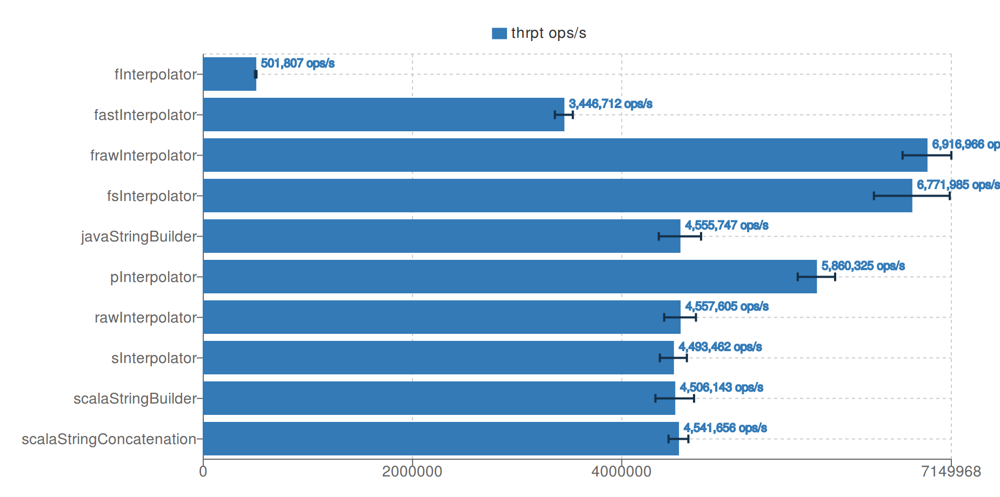
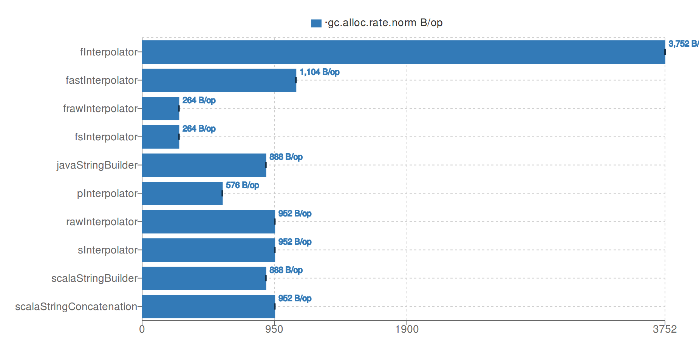

# Fast String Interpolator

[](https://ci.appveyor.com/project/plokhotnyuk/fast-string-interpolator/branch/master)
[](https://travis-ci.org/plokhotnyuk/fast-string-interpolator)
[](https://codecov.io/gh/plokhotnyuk/fast-string-interpolator)
[](https://search.maven.org/search?q=com.github.plokhotnyuk.fsi)

Scala macro that generates ultra-fast string interpolators.

## Acknowledgments

A general idea and some parts of code was borrowed from a great article ["Scala: String Interpolation Performance" by Dmitry Komanov](https://medium.com/@dkomanov/scala-string-interpolation-performance-21dc85e83afd).

## Goals, features, and limitations

A high-performance 100% compatible drop-in replacement of simple and raw string interpolators (`s""` or `raw""` literals).

Currently, it doesn't support formatting string interpolator (`f""` literal), however this will probably be added soon.

## How to use

Add the library to a dependency list:

```sbt
libraryDependencies += "com.github.plokhotnyuk.fsi" %% "fsi-macros" % "0.6.0"
```

Add import and replace prefix `s` by `fs` (or for a raw string interpolator `raw` by `fraw`):

```scala
import com.github.plokhotnyuk.fsi._

val host = "company.com"
val path = "blog"
fs"http://$host/$path"
fraw"http://$host/$path"
```

That's it! You have got ~1.5x speed up in runtime and ~4x less usage of heap memory comparing to standard interpolators
which come with 2.12.8 version of Scala compiler.

Also, it is more efficient than a simple concatenation of strings by the `+` operator or using string builders for that.

Check for benchmark results where the fast string interpolator compared with standard Scala interpolators, 3rd-party
interpolators, Scala/Java string builders, and a string concatenation using JDK 8 and Scala 2.12.5:
- *fInterpolator* - standard string interpolator with formatting
- *fastInterpolator* - the [fastring](https://github.com/Atry/fastring) interpolator
- *frawInterpolator* - fast string interpolator replacement for raw string interpolator
- *fsInterpolator* - fast string interpolator replacement for simple string interpolator
- *javaStringBuilder* - java.lang.StringBuilder
- *pInterpolator* - the [perfolation](https://github.com/outr/perfolation) interpolator
- *rawInterpolator* - standard raw string interpolator
- *sInterpolator* - standard simple string interpolator
- *scalaStringBuilder* - scala.collection.mutable.StringBuilder
- *scalaStringConcatenation* - `+` operand for strings

[](docs/fast_string_interpolator_throughput.png)

[](docs/fast_string_interpolator_heap_usage.png)

*NOTE*: Numbers can vary depending on use case, payload, JDK, and Scala versions. For cases, like templating with lot
of nested cycles, please consider using of [fastring](https://github.com/Atry/fastring) or string builders immediately.

[Results of benchmarks](https://plokhotnyuk.github.io/fast-string-interpolator) which compare performance of Fast String
Interpolator with other alternatives for different cases of simple and nested loop usage, and for different versions of
JDK and Scala.

### How it works

Let we have defined functions: `def f(): Int` and `def g(): Double`, then in compile-time for `fs"a${f()}bb${g()}"`
the following code will be generated:

```scala
{
  val fresh$macro$1: Int = f();
  val fresh$macro$2: Double = g();
  com.github.plokhotnyuk.fsi.`package`.stringBuilder().append('a').append(fresh$macro$1).append("bb").append(fresh$macro$2).toString();
}: String
```

You can check this by adding a compiler option: `scalacOptions += "-Ymacro-debug-lite"`.

In this code ```com.github.plokhotnyuk.fsi.`package`.stringBuilder()``` stands for getting a preallocated instance of
`java.lang.StringBuilder` from the thread-local pool.

By default a buffer capacity of all created `java.lang.StringBuilder` instances is 16384 characters (32Kb). If limit
is reached buffer size grows to ensure that whole string can fit in it. However next retrieval from the pool a new
`java.lang.StringBuilder` instance will be allocated with the default size of the buffer and returned to avoid
exhausting of Java heap. So if you want to work with longer strings without reallocations then set a greater value for
the following JVM system property: `com.github.plokhotnyuk.fsi.buffer.size`.

## How to contribute

### Build

To compile, run tests, check coverage, and check binary compatibility for different Scala versions use a command:

```sh
sbt ++2.11.12 clean coverage test coverageReport mimaReportBinaryIssues
sbt ++2.12.8 clean coverage test coverageReport mimaReportBinaryIssues
```

### Run benchmarks

Feel free to modify benchmarks and check how it works on your payload, JDK, and Scala versions.

To see throughput with allocation rate for different approaches of string concatenation run benchmarks with GC profiler
for a specified JDK and Scala versions using the following command:

```sh
sbt -java-home /usr/lib/jvm/jdk1.8.0 -no-colors ++2.12.8 clean 'fsi-benchmark-core/jmh:run -jvm /usr/lib/jvm/jdk-11/bin/java -prof gc -rf json -rff jdk-11_scala-2.12.8.json .*'
```

It will save benchmark report in a specified JSON file.

Results that are stored in JSON can be easy plotted in [JMH Visualizer](http://jmh.morethan.io/) by drugging & dropping
of your file to the drop zone or using the `source` parameter with an HTTP link to your file in the URL like
[here](http://jmh.morethan.io/?source=https://plokhotnyuk.github.io/fast-string-interpolator/jdk-8_scala-2.12.5.json).

### Publish locally

Publish to the local Ivy repo:

```sh
sbt +publishLocal
```

Publish to the local Maven repo:

```sh
sbt +publishM2
```

### Release

For version numbering use [Recommended Versioning Scheme](http://docs.scala-lang.org/overviews/core/binary-compatibility-for-library-authors.html#recommended-versioning-scheme)
that is used in the Scala ecosystem.

Double check binary and source compatibility (including behavior) and run `release` command (credentials required):

```sh
sbt release
```
